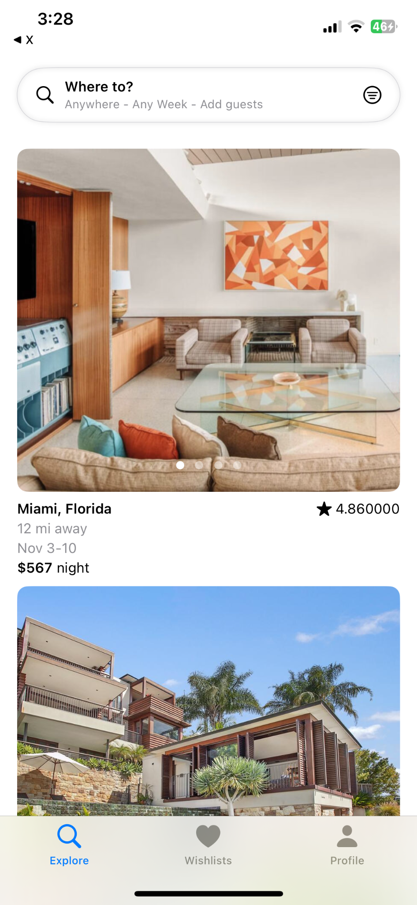

### User
Convert this image of a home screen of an app into swiftui.

### Swifty
Creating a SwiftUI view that mimics the interface shown in the image involves several components: a navigation bar, a search bar, a scrolling list of cards for places to stay, and a tab bar.

Here is a high-level example of how you might structure this SwiftUI view:

```swift
import SwiftUI

struct ContentView: View {
    var body: some View {
        NavigationView {
            VStack {
                // Search Bar
                HStack {
                    Image(systemName: "magnifyingglass")
                    TextField("Where to?", text: .constant(""))
                    Button(action: {}) {
                        Image(systemName: "slider.horizontal.3")
                    }
                }
                .padding()
                .background(Color(.systemGray6))
                .cornerRadius(10)
                .padding()

                // List of Cards
                ScrollView {
                    VStack(spacing: 20) {
                        ForEach(0..<10) { _ in
                            PlaceCard()
                        }
                    }
                }

                Spacer()

                // Tab Bar
                TabBar()
            }
            .navigationTitle("Explore")
        }
    }
}

struct PlaceCard: View {
    var body: some View {
        VStack(alignment: .leading) {
            Image("house")
                .resizable()
                .aspectRatio(contentMode: .fill)
                .frame(height: 200)
                .clipped()
            HStack {
                VStack(alignment: .leading) {
                    Text("Miami, Florida")
                        .font(.headline)
                    Text("12 mi away")
                        .font(.subheadline)
                    Text("Nov 3-10")
                        .font(.subheadline)
                }
                Spacer()
                VStack(alignment: .trailing) {
                    Text("$567")
                        .font(.title)
                    Text("/ night")
                        .font(.subheadline)
                }
            }
            .padding()
        }
        .background(Color.white)
        .cornerRadius(15)
        .shadow(radius: 5)
        .padding(.horizontal)
    }
}

struct TabBar: View {
    var body: some View {
        HStack {
            Spacer()
            Button(action: {}) {
                Image(systemName: "house.fill")
            }
            Spacer()
            Button(action: {}) {
                Image(systemName: "heart")
            }
            Spacer()
            Button(action: {}) {
                Image(systemName: "person.fill")
            }
            Spacer()
        }
        .padding()
        .background(Color.white)
        .shadow(radius: 5)
    }
}

@main
struct MyApp: App {
    var body: some Scene {
        WindowGroup {
            ContentView()
        }
    }
}
```

This is a simplified example and does not include the top status bar with the time and battery indicator, or the exact styling and images from your screenshot. To match the look more closely, you would need to customize the fonts, colors, and other UI elements, and use actual images either from assets or loaded from a URL.

### User
All of the text and the url for the image should be contained in a viewmodel for the PlaceCard view.

### Swifty
Given that you're looking for a ViewModel for the PlaceCard view in SwiftUI, let's design a PlaceCardViewModel that will contain all necessary data. The ViewModel will provide properties for the image URL, location name, distance, date range, and price per night. These properties can then be bound to the SwiftUI view.

Here's how you could implement the PlaceCardViewModel and update the PlaceCard view to use this ViewModel:

```swift
import Foundation
import SwiftUI

// ViewModel for each place card
class PlaceCardViewModel: ObservableObject {
    @Published var imageURL: URL
    @Published var locationName: String
    @Published var distance: String
    @Published var dateRange: String
    @Published var pricePerNight: String
    
    init(imageURL: URL, locationName: String, distance: String, dateRange: String, pricePerNight: String) {
        self.imageURL = imageURL
        self.locationName = locationName
        self.distance = distance
        self.dateRange = dateRange
        self.pricePerNight = pricePerNight
    }
}

// SwiftUI View for the Place Card
struct PlaceCard: View {
    @ObservedObject var viewModel: PlaceCardViewModel
    
    var body: some View {
        VStack(alignment: .leading) {
            // AsyncImage introduced in iOS 15 to load images from a URL
            AsyncImage(url: viewModel.imageURL) { image in
                image.resizable()
            } placeholder: {
                Color.gray
            }
            .aspectRatio(contentMode: .fill)
            .frame(height: 200)
            .clipped()
            
            HStack {
                VStack(alignment: .leading) {
                    Text(viewModel.locationName)
                        .font(.headline)
                    Text(viewModel.distance)
                        .font(.subheadline)
                    Text(viewModel.dateRange)
                        .font(.subheadline)
                }
                Spacer()
                VStack(alignment: .trailing) {
                    Text(viewModel.pricePerNight)
                        .font(.title)
                    Text("/ night")
                        .font(.subheadline)
                }
            }
            .padding()
        }
        .background(Color.white)
        .cornerRadius(15)
        .shadow(radius: 5)
        .padding(.horizontal)
    }
}

// Example Usage
struct ContentView: View {
    var body: some View {
        ScrollView {
            // Simulating a list of places with dummy data
            ForEach(0..<10) { _ in
                // Initialize the ViewModel with example data
                PlaceCard(viewModel: PlaceCardViewModel(
                    imageURL: URL(string: "https://example.com/image.jpg")!,
                    locationName: "Miami, Florida",
                    distance: "12 mi away",
                    dateRange: "Nov 3-10",
                    pricePerNight: "$567"
                ))
            }
        }
    }
}
```
### User
The placecardviewmodel should use a Service which has an async method to get information to be displayed. Service should use swifts Concurrency framework.

### Swifty
To create a service that fetches information for the PlaceCardViewModel using Swift's concurrency framework, you would define a protocol for the service and implement it using async/await. Here's a step-by-step implementation:

```swift
import SwiftUI
import Combine

// Protocol for the service that fetches place information
protocol PlaceInfoServiceProtocol {
    func fetchPlaceInfo() async throws -> PlaceInfo
}

// Concrete service that fetches the information
class PlaceInfoService: PlaceInfoServiceProtocol {
    func fetchPlaceInfo() async throws -> PlaceInfo {
        // Simulate network request
        // Replace this with actual networking code to fetch data from an API
        return await withCheckedContinuation { continuation in
            // Simulate network delay
            DispatchQueue.global().asyncAfter(deadline: .now() + 2) {
                continuation.resume(returning: PlaceInfo(imageURL: URL(string: "https://example.com/image.jpg")!,
                                                        locationName: "Miami, Florida",
                                                        distance: "12 mi away",
                                                        dateRange: "Nov 3-10",
                                                        pricePerNight: "$567"))
            }
        }
    }
}

// ViewModel for each place card
class PlaceCardViewModel: ObservableObject {
    @Published var placeInfo: PlaceInfo?
    var service: PlaceInfoServiceProtocol
    
    init(service: PlaceInfoServiceProtocol) {
        self.service = service
    }
    
    // Method to load place information
    func loadPlaceInfo() {
        Task {
            do {
                let fetchedInfo = try await service.fetchPlaceInfo()
                DispatchQueue.main.async {
                    self.placeInfo = fetchedInfo
                }
            } catch {
                print(error)
            }
        }
    }
}

// Model to hold the fetched place information
struct PlaceInfo {
    var imageURL: URL
    var locationName: String
    var distance: String
    var dateRange: String
    var pricePerNight: String
}

// SwiftUI View for the Place Card
struct PlaceCard: View {
    @ObservedObject var viewModel: PlaceCardViewModel
    
    var body: some View {
        VStack(alignment: .leading) {
            // ...
            // Use the properties from viewModel.placeInfo
            // ...
        }
        .onAppear {
            viewModel.loadPlaceInfo()
        }
    }
}

// Example Usage
struct ContentView: View {
    var body: some View {
        PlaceCard(viewModel: PlaceCardViewModel(service: PlaceInfoService()))
    }
}
```
### Swifty
In this setup:

1. **PlaceInfoServiceProtocol** is the protocol defining the fetch method.
2. **PlaceInfoService** is a class that conforms to **PlaceInfoServiceProtocol** and implements the method using async/await.
3. **PlaceCardViewMode**l is the view model that uses an instance of **PlaceInfoServiceProtocol** to load data.
4. **PlaceCard** is the SwiftUI view that observes the **PlaceCardViewModel** and presents the data.

This is a high-level example. Your actual implementation may involve more complex data handling and error management. When integrating with a real API, you'll replace the simulated network request with an actual HTTP request using URLSession or another networking library that supports Swift's concurrency.
